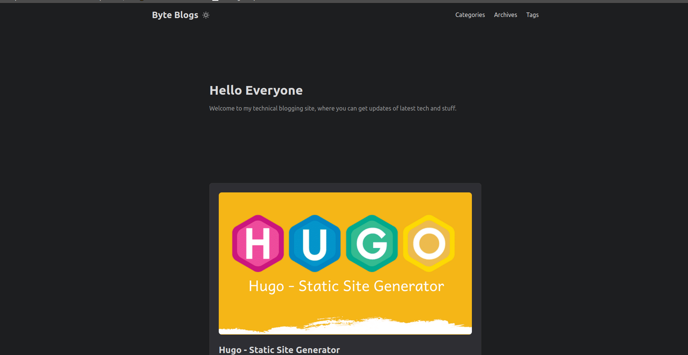
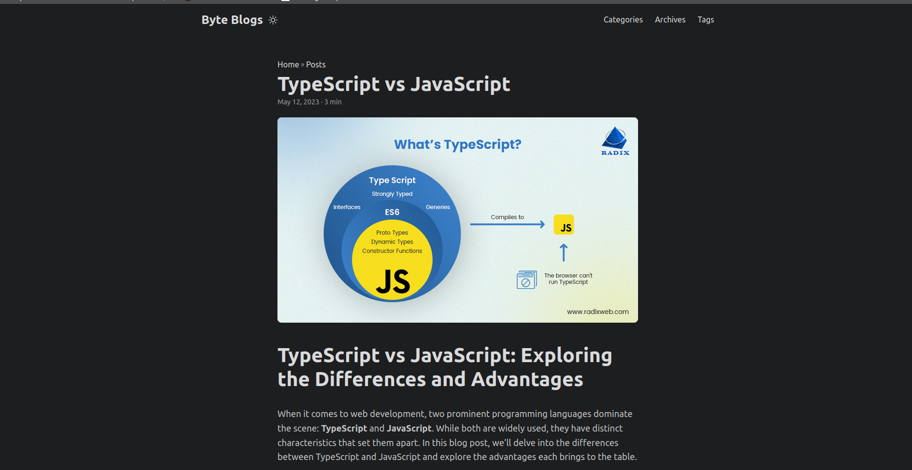

# Byte Blogs

Static Blogging site created using Hugo

Home Page



Blog Page




## Installation

Clone the repo

```bash
git clone https://github.com/kanhaiya04/byte_blogs.git
cd byte-blogs
```

Use the package manager to install dependencies.

```bash
npm install
```

## Run on local server

To start the Hugo server
```bash
hugo server
```

